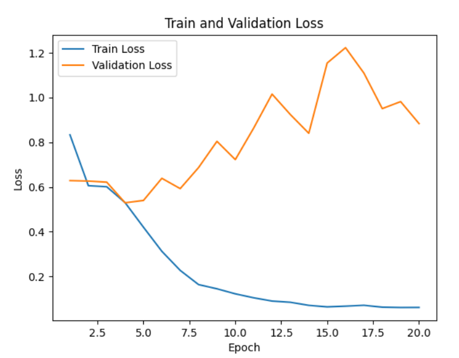

### Dataset

*(Corpus sample, here 0 means unacceptable and 1 means acceptable)*

The Corpus of Linguistic Acceptability (https://nyu-mll.github.io/CoLA/) is a dataset comprising 10,657 English sentences sourced from 23 linguistics publications. Each sentence is annotated for grammatical acceptability, indicating whether it is grammatically correct or not. These annotations were made by experts.

### About LoRA

*(Image credit: https://arxiv.org/pdf/2106.09685)*

Low Rank Adaptation (LoRA) is a technique used for fine-tuning Large Language Models (LLMs) efficiently by injecting trainable low-rank matrices into each layer. During fine-tuning we free the weights of the LLMs and only train the weights of low-rank matrices, greatly reducing the number of trainable parameters. In our case the no. of trainable parameter reduced by 99.5% (from 125M to 0.63M) when used LoRA rank = 4.

The key idea behind LoRA is that instead of updating the full weight matrix $W$, decompose the update as $W + \Delta W$, where only $\Delta W$ is updated (trained) and $W$ is kept frozen. We represents $\Delta W$ as $\Delta W = AB$ where $A \in \mathbb{R}^{d \times r}$ and $B \in \mathbb{R}^{r \times d}$ .

This way the number of trainable parameters can be reduced significantly when we choose $r << \min(d, k)$ 

### GPT-2 Model

*(Image credit: https://bea.stollnitz.com/blog/gpt-transformer/, the illustration is adapted from the [Attention is all you need](https://arxiv.org/abs/1706.03762) paper.)* 

**GPT-2 (Generative Pretrained Transformer 2)** is a large language model developed by OpenAI. It is based on the decoder of the Transformer architecture and is trained with causal language modeling objective to predict the next token given previous tokens. It was trained on a large corpus of internet text (called WebText), consisting of over 8 million documents and 40GB of text.

### Using GPT-2 for classification

The CoLA dataset contains sentences in english as the input and the output is whether the sentence is grammatically correct or not; so this a classification task. 
GPT-2 predicts the next token given previous tokens, so we have to adapt the GPT-2 model to only predict Yes or No instead of one of the 50,257 tokens in the vocabulary.

*(Illustration showing output of size embedding dimension is projected into a vector of size 2)*

To do this we are projecting down the embedding dimension into a vector of size 2 to get the logits.
We then used the Binary Cross Entropy loss for the fine-tuning.

### Result

*(Training and validation losses)*

*(Training and validation accuracy plots)*

**Accuracy after fine-tuning:**  76%